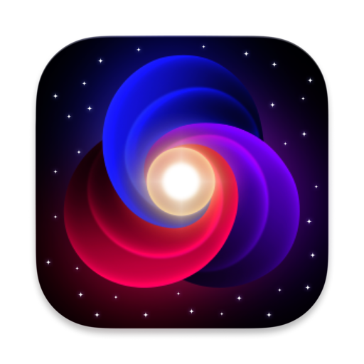

# Nova Assistant: AI Browser Automation

Nova is an intelligent AI partner that understands the user’s intent, navigates websites autonomously, and executes tasks on the user’s behalf while explaining each action step.

## Installing and Running

### Download and Install the extension in your browser

1. Go to the [releases page](https://github.com/ibra-kdbra/Nova_Assistant/releases), find the latest version of the extension and download "nova-assistant.zip".
2. Unzip the file.
3. Load your extension on Chrome by doing the following:
   1. Navigate to `chrome://extensions/`
   2. Toggle `Developer mode`
   3. Click on `Load unpacked extension`
   4. Select the unzipped folder

### Use the extension

*Please note that you may need to refresh the page for the extension to work.*

1. Find the Nova icon in the top right corner of your browser and click on it to open the sidepanel.
2. Create or access an existing [OpenAI API Key](https://platform.openai.com/account/api-keys) or [Anthropic API key](https://console.anthropic.com/settings/keys) and paste it in the provided box. This key will be stored in your browser, and will not be uploaded to a third party.
3. Finally, navigate to a webpage you want Nova and type in the task you want it to perform.

### Build the extension

If you want to build the extension from source, follow these instructions:

1. Ensure you have [Node.js](https://nodejs.org/). The development was done on Node v20 but it should work with some lower versions.
2. Clone this repository
3. Install `pnpm` globally: `npm install -g pnpm`
4. Run `pnpm install`
5. Run `pnpm dev` to start the development server, or `pnpm build` to build the extension.

When loading the extension, you will need to load the `dist` folder created by the build process.
